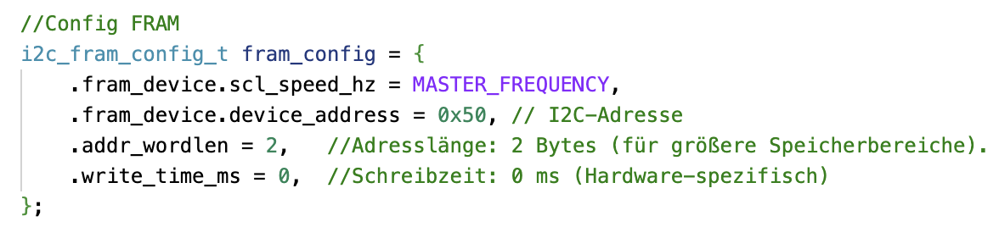
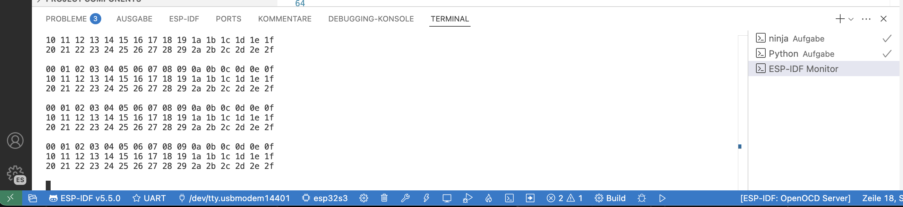
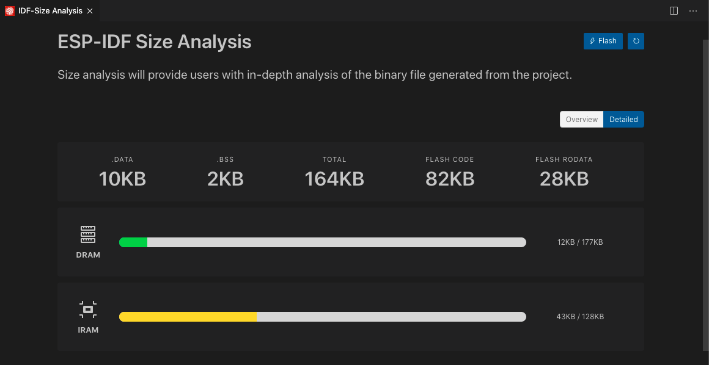

| Supported Targets | ESP32-C2/C3 | ESP32-C5/C6 | ESP32-H2 | ESP32-P4 | ESP32-S2/S3 | T-Display-S3/...S3-AMOLED |
| ----------------- |  ---------- | ----------- | -------- | -------- | ----------- | ------------------------- |

# I2C FRAM example

EN: This code demonstrates how to use the I2C master mode to read/write I2C FRAM.<br>
The code was created from the I2C_EEPROM library and adapted for use with FRAM.<br>
**Note:** This code was created with the help of natural Inelligenz.
Artificial intelligence (AI) was used for code checking.

DE: Dieser Code veranschaulicht, wie der I2C-Mastermodus zum Lesen/Schreiben von I2C-FRAM verwendet wird.<br>
Der Code wurde aus der Lib I2C_EEPROM erstellt und für die Verwendung mit FRAM angepasst.<br>
**Hinweis:** Dieser Code wurde mit Hilfe natürlich Inelligenz erstellt.
Künstliche Intelligenz (KI) wurde zur Code Prüfung verwendet.

## How to use

### Hardware Required

EN: For this example, you'll need:<br>
- 1x ESP32-based development board<br>
- 1x FRAM module<br>
- USB cable<br>
- cable for I2C (V+, GND, SDA und SCL)<br>

The I²C bus allows the use of multiple slaves (FRAMs, LCD, sensors, port extensions, etc.).
Some I²C-FRAM have pins A0, A1 and A2 for address configuration. Other I²C slaves do not have pins for address configuration, but do have enable pins (CS). This is where you can use GPIO pins.
The hardware addressing must match the software:
show you "Config FRAM"

DE: Für dieses Beispiel benötigen Sie:<br>
- 1x ESP32-basiertes Entwicklungsboard<br>
- 1x FRAM-Modul zB. MB85RC256V<br>
- USB Kabel<br>
- Verbindungskabel für I2C (V+, GND, SDA und SCL)<br>

Der I²C-Bus ermöglicht die Verwendung mehrerer Slave (FRAMs, LCD, Sensoren, Porterweiterungen, etc.).
Einige I²C-FRAM verfügen über die Pins A0, A1 und A2 zur Adresskonfiguration.
Andere I²C-Slaves verfügen über keine Pins zur Adresskonfiguration, dafür aber über Enable-Pins (CS). Hier können Sie GPIO-Pins verwenden.
Die Hardware-Adressierung muß mit der Software übereinstimmen:

<div style="border: 1px solid grey; width: fit-content; display: inline-block;">
    
</div>

### Pin Assignment:

EN: **Note:** The following pin assignments and adresses are used by default, you can change these in the `menuconfig`.<br>
DE: **Hinweis:** Standardmäßig werden folgende Pinbelegungen und Adressen verwendet, diese können Sie in der `menuconfig` ändern
```Text
|                  | SDA              | SCL              | Adresse        |
| ---------------- | ---------------- | ---------------- | -------------- |
| ESP I2C Master   | I2C_MASTER_SDA 4 | I2C_MASTER_SCL 5 |                |
| FRAM1            | SDA              | SCL              | 0x50...        |
| Display          | SDA              | SCL              | 0x3C           |
| Sensor BMP280    | SDA              | SCL              | 0x76           |
| Sensor INA219    | SDA              | SCL              | 0x40...        |
| Portexpander     | SDA              | SCL              | 0x20...        |
```
EN: For the actual default value of `I2C_MASTER_SDA` and `I2C_MASTER_SCL` see `Example Configuration` in `menuconfig`.
**Note:** There's no need to add an external pull-up resistors for SDA/SCL pin, because the driver will enable the internal pull-up resistors.<br>

DE: Für den tatsächlichen Standardwert von `I2C_MASTER_SDA` und `I2C_MASTER_SCL` siehe `Beispielkonfiguration` in `menuconfig`. <br>
**Hinweis:** Es ist nicht erforderlich, externe Pull-up-Widerstände für den SDA/SCL-Pin hinzuzufügen, da der Treiber die internen Pull-up-Widerstände aktiviert.<br>

## Build and Flash

EN: In the footer, you need to review and adjust the following settings:
1. Interface Type
2. The port where the ESP32 board is connected
3. the ESP32 type

DE: In der Fußzeile müssen Sie folgende Einstellungen überprüfen und anpassen:
1. Schnittstellentyp
2. den Port wo das ESP32-Bord angeschlossen ist
3. den ESP32-Type

show animation:


EN: Press the "flash" icon  in the footer or in the IDF terminal:

DE: Drücke in der Fußzeile das "flash" Symbol 

EN: See the [Getting Started Guide](https://docs.espressif.com/projects/esp-idf/en/latest/get-started/index.html) for full steps to configure and use ESP-IDF to build projects.

## Example Output




## ESP-IDF Application Size Analysis

EN: The ESP-IDF Application Size Analysis tool provides a detailed breakdown of your application’s memory usage, helping developers optimize storage allocation.<br><br>
DE: Das ESP-IDF-Tool zur Analyse der Anwendungsgröße bietet eine detaillierte Aufschlüsselung der Speicherauslastung Ihrer Anwendung und hilft Entwicklern, die Speicherzuweisung zu optimieren.<br>

Navigate to:
<br>
Press: shift + >  type: `ESP-IDF: Size Analyse of the Binaries`<br>
<br>
<br>

